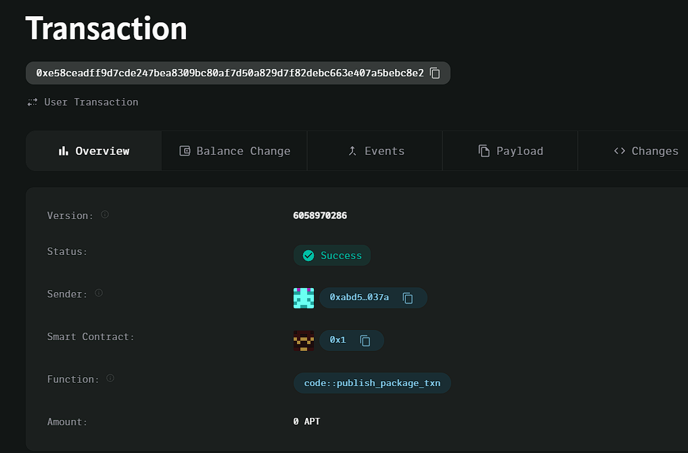

### Deployed smartcontract address: 0xe58ceadff9d7cde247bea8309bc80af7d50a829d7f82debc663e407a5bebc8e2

### Screenshot: 

# Decentralized Loyalty Program

## Project Title
Decentralized Loyalty Program

## Project Description
A decentralized system where businesses reward customers with loyalty points on the blockchain. These loyalty points can be redeemed by customers for discounts, rewards, or other benefits. The program runs on the Aptos blockchain and uses smart contracts to securely track and manage loyalty points.

## Vision
The vision of the **Decentralized Loyalty Program** is to provide a transparent, secure, and flexible system for businesses to engage customers and build loyalty. By leveraging the blockchain, this program ensures that loyalty points are immutable, easily transferable, and secure from fraud or tampering. Customers have full control over their points and can redeem them seamlessly without intermediaries.

## Key Features
- **Reward Points System**: Businesses can issue loyalty points to customers directly on the blockchain.
- **Redeem Points**: Customers can redeem their loyalty points for discounts, products, or other rewards.
- **Immutability and Security**: Blockchain technology ensures that points cannot be tampered with or fraudulently redeemed.
- **Easy Integration**: Businesses can easily integrate this loyalty program with their existing customer reward systems.

## Future Scope
- **Loyalty Point Exchange**: Future versions could allow customers to trade or exchange loyalty points between different businesses.
- **Tokenized Rewards**: The loyalty points can be tokenized and used as part of a broader ecosystem for rewards and benefits.
- **Analytics for Businesses**: Add features that allow businesses to track and analyze customer engagement through their loyalty programs.
- **Cross-Chain Compatibility**: Extend the program to work with other blockchains for wider adoption and utility.
